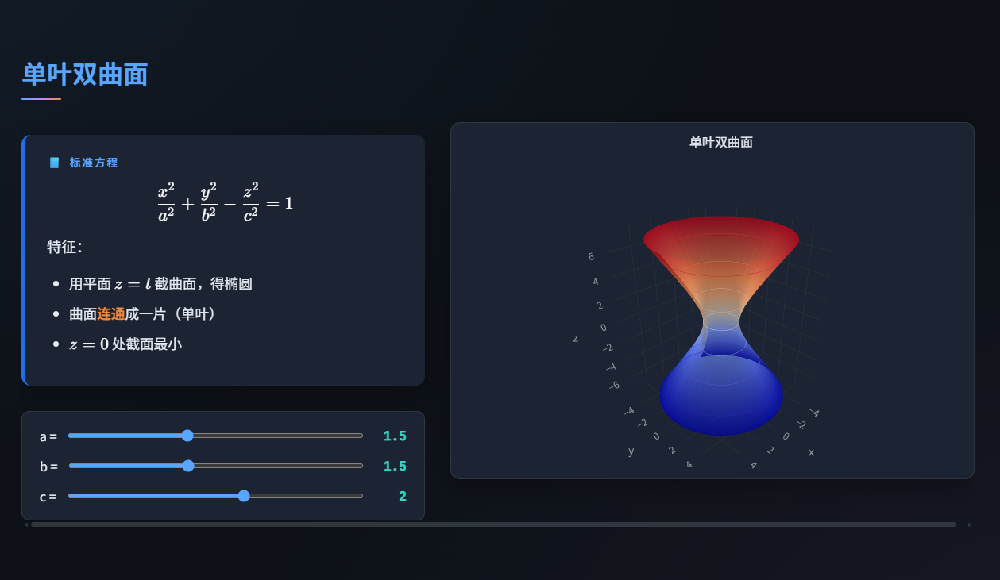

<p align="center">
  <h1 align="center">math-ppt-html</h1>
  <p align="center"><strong>零依赖 · 纯静态 · 专业数学幻灯片</strong></p>
  <p align="center">一个教学 Skill — 输入主题，浏览器即开即用的交互式数学课件</p>
  <br>
  <p align="center">
    
    
    
    
  </p>
</p>

---

### 不是 PPTX，是网页

生成的课件是纯静态 `.html` 文件，**没有任何运行时依赖** — 不用 Python、不用 Node.js、不用 LaTeX。拷到 U 盘都能用。

<table>
  <tr>
    <td width="50%">
      
      <p align="center"><em>公式排版 + 卡片式定义</em></p>
    </td>
    <td width="50%">
      
      <p align="center"><em>交互式 3D 可视化</em></p>
    </td>
  </tr>
</table>

---

### 为什么用它

| 痛点 | 传统做法 | 用 math-ppt-html |
|------|---------|------------------|
| 公式排版 | 拼字、截图、MathType | KaTeX 原生渲染 |
| 做数学图形 | GeoGebra 截图 → 贴进 PPT | Plotly.js 交互相应，实时调节参数 |
| 修改内容 | 逐个文本框改 | AI 直接改 HTML，一句话的事 |
| 分享课件 | 发文件 / 担心兼容 | 一个 `.html`，浏览器即开 |
| 动画演示 | PPT 动画，调半天 | CSS 动画 + 逐步推导展开 |

---

### 快速开始

**1.** 在 Claude Code 中安装本 Skill  
**2.** 说一句话：

```
帮我做曲面方程的课件
生成线性变换的数学幻灯片
可视化展示傅里叶级数
```

**3.** 生成的课件在 `workspace/学习/{分类}/{主题名}/` 下，浏览器打开 `index.html`

> 也支持直接丢一个 `.pptx` 文件让 AI 自动转化，或列出知识点让它帮你组织。

---

### 核心能力

<table>
  <tr>
    <td><strong>PPT 式浏览</strong></td>
    <td>← → 翻页 · T 键缩略图 · F 键全屏 · 触摸滑动 · 进度条</td>
  </tr>
  <tr>
    <td><strong>数学公式</strong></td>
    <td>KaTeX 渲染，支持 <code>aligned</code> / <code>cases</code> / <code>matrix</code> 等环境</td>
  </tr>
  <tr>
    <td><strong>2D/3D 图形</strong></td>
    <td>Plotly.js 驱动，函数图 · 曲面 · 向量场 · 旋转/缩放/参数滑块</td>
  </tr>
  <tr>
    <td><strong>推导动画</strong></td>
    <td>逐步展开公式推导，点击或空格键推进，当前步骤高亮</td>
  </tr>
  <tr>
    <td><strong>主题切换</strong></td>
    <td>深色模式（护眼）· 浅色模式（投影优化）</td>
  </tr>
</table>

---

### 技术栈

| 组件 | 方案 | 
|------|------|
| 公式渲染 | [KaTeX](https://katex.org) v0.16.9 |
| 图形可视化 | [Plotly.js](https://plotly.com) v2.27.0 |
| 动画系统 | 纯 CSS `@keyframes` + `transition` |
| 翻页逻辑 | 原生 JavaScript，零框架 |

> 全部通过 CDN 加载，无需 `npm install` 或任何包管理器。

---

### 数学主题覆盖

- **微积分** — 函数与极限、切线动画、黎曼和、旋转体
- **空间解析几何** — 二次曲面、空间曲线、Frenet 标架
- **线性代数** — 矩阵变换、特征向量、行列式可视化
- **概率统计** — 分布曲线、参数调节、置信区间
- **微分方程** — 方向场、解曲线、相平面
- **无穷级数** — 部分和逼近、收敛动画

---

### 项目结构

```
workspace/学习/{分类}/{主题名}/
├── index.html          # 主幻灯片文件
├── css/slides.css      # 样式（含双主题）
├── js/
│   ├── slides.js       # 翻页/导航/动画
│   └── math-viz.js     # Plotly.js 可视化
└── assets/images/
```

---

### 兼容性

Chrome · Edge · Firefox · Safari 完整支持，移动端适配触摸滑动。

---

<p align="center">
  <sub>MIT License · Made for better math teaching</sub>
</p>
